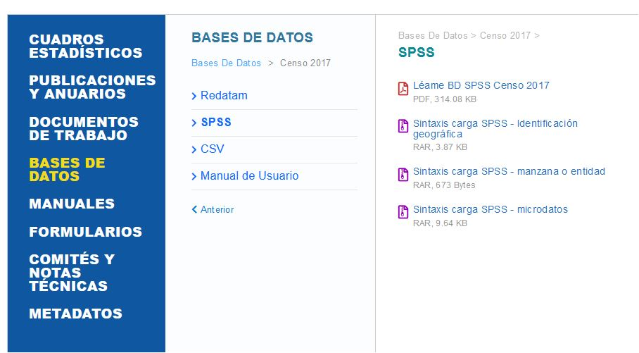

```{r setup, include=FALSE}
knitr::opts_chunk$set(echo = TRUE)
```

## R 

¿Qué es un archivo SPS?

SPS es Archivo de programa utilizado por SPSS, una aplicación de análisis estadístico; guardado en un formato de texto sin formato y contiene instrucciones escritas usando la sintaxis de SPSS; generalmente desarrollado con SPSS Syntax Editor; utilizado para manipular conjuntos de datos y automatizar análisis estadísticos. 





```{r}
library(foreign)
#file.choose()
```

```{r}
#x=spss.fixed.file(file=data.dat,columns.file=microdatos/Microdato_Censo2017-Personas.sps,varlab.file=input.sps)

```


```{python}

```


