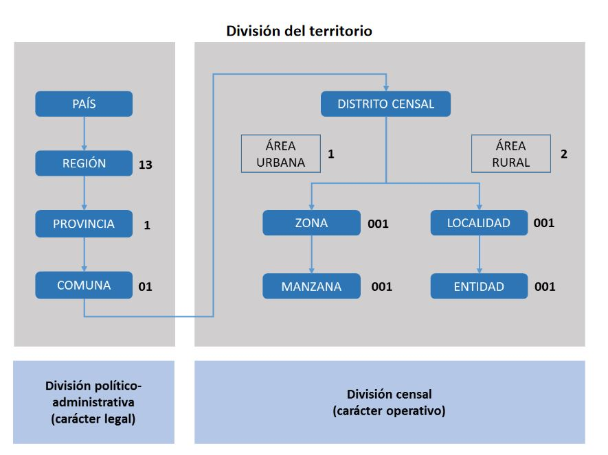

```{r setup, include=FALSE}
knitr::opts_chunk$set(echo = TRUE)
```

## R 

```{r}
y <- readRDS("casen_2017_c.rds")
y
```


Fue abierta la base de datos CSV


```{r}
library("rio")
x <- import("Microdato_Censo2017-Personas.csv")
```


```{r}
x
```


```{r}
sumadepersonas <- nrow(x)
sumadepersonas
```

```{r}
sum(P08)
```


```{r}
library(sqldf)

sqldf('SELECT * FROM x WHERE P08 == 2')
```

SELECT * FROM Customers
WHERE Country='Mexico'; 


son 17,574,003 filas, asi que subseteamos a 1000

```{r}
x_sub_1000 <- x[c(1:1000),]
x_sub_1000
```


```{r}
x_sub_1000$x <- paste(x_sub_1000$COMUNA, x_sub_1000$DC, x_sub_1000$AREA,  x_sub_1000$ZC_LOC, sep="")
```


```{r}

x_sub_1000
```




```{r}

```


```{r}
library(sqldf)

sqldf('SELECT COMUNA FROM x_sub_1000 WHERE ESCOLARIDAD > 8 ORDER BY COMUNA ASC')
```


###############################################
necesito el paso siguiente
###############################################


La construccion del codigo censal

Pais, region, provincia, comuna

distrito censal y:

zona a o localidad.


no es necesario llegar al momento de la manzana o entidad.


```{r}
read.csv2("censo/csv manzana/microdato_censo2017-geografia_manzanas.csv")
```


```{r}
read.csv2("censo/csv manzana/censo2017_manzanas (2).csv")
```


